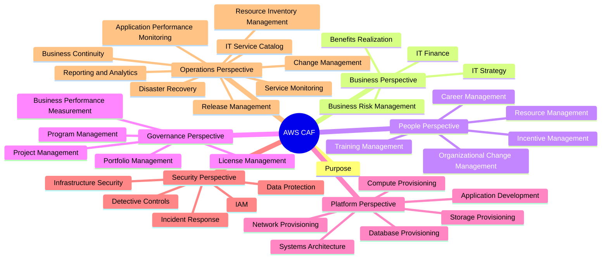

# AWS Cloud Adoption Framework (CAF)

---

# Detailed Notes

---
# 1. AWS Cloud Adoption Framework (CAF)

## Definition

AWS Cloud Adoption Framework (CAF) is a framework developed by AWS to help organizations successfully adopt cloud computing.

It provides guidance, best practices, and organizational strategies that help businesses transition from traditional IT environments to cloud-based environments.

CAF focuses on aligning:

- Business Goals
- People
- Processes
- Technology

to support successful cloud adoption.

---

## Why AWS CAF Exists

Moving to the cloud is not only a technical project.

Many cloud migration projects fail because organizations focus only on technology and ignore:

- Business requirements
- Organizational structure
- Employee readiness
- Governance
- Security
- Operations

AWS CAF helps organizations prepare for cloud adoption holistically.

---

## Main Objectives

AWS CAF helps organizations:

- Accelerate cloud adoption
- Reduce migration risks
- Improve governance
- Improve security
- Increase operational efficiency
- Align cloud initiatives with business goals

---

## CAF Focus Areas

AWS CAF focuses on:

### Business

Ensuring cloud initiatives support business goals.

### People

Preparing employees and teams.

### Process

Creating operational and governance processes.

### Technology

Building and managing cloud infrastructure.

---

## AWS CAF Perspectives

AWS CAF consists of six perspectives:

1. Business Perspective
2. People Perspective
3. Governance Perspective
4. Platform Perspective
5. Security Perspective
6. Operations Perspective

Each perspective addresses a different aspect of cloud adoption.

---

## Exam Notes

Keywords:

- Cloud Adoption
- Business
- People
- Process
- Technology
- Organizational Transformation

usually indicate AWS CAF concepts.

---

## Quick Summary

AWS CAF provides a structured approach that helps organizations successfully adopt cloud technologies while aligning business, people, process, and technology requirements.

---

# 2. Business Perspective

## Purpose

The Business Perspective ensures that cloud adoption aligns with business objectives and delivers measurable value.

This perspective helps decision-makers understand the business impact of cloud investments.

---

## Capabilities

### IT Finance

Manages cloud-related financial planning and budgeting.

---

### IT Strategy

Aligns cloud initiatives with organizational goals.

---

### Benefits Realization

Measures whether cloud adoption delivers expected value.

---

### Business Risk Management

Identifies and manages business risks associated with cloud adoption.

---

## Key Goal

Ensure cloud adoption supports organizational success and business growth.

---

## Quick Summary

Business Perspective focuses on maximizing business value and aligning cloud initiatives with strategic objectives.

---

# 3. People Perspective

## Purpose

The People Perspective focuses on preparing employees and organizational structures for cloud adoption.

Cloud transformation often requires new skills, responsibilities, and ways of working.

---

## Capabilities

### Resource Management

Ensures appropriate staffing and resource allocation.

---

### Incentive Management

Aligns employee incentives with organizational goals.

---

### Career Management

Supports professional growth and role evolution.

---

### Training Management

Develops cloud-related skills.

---

### Organizational Change Management

Helps employees adapt to organizational changes.

---

## Key Goal

Prepare people and teams for successful cloud adoption.

---

## Quick Summary

People Perspective focuses on workforce readiness and organizational transformation.

---

# 4. Governance Perspective

## Purpose

The Governance Perspective ensures that cloud investments are controlled, measured, and aligned with organizational objectives.

---

## Capabilities

### Portfolio Management

Manages cloud investment priorities.

---

### Program Management

Coordinates cloud-related initiatives.

---

### Project Management

Ensures successful project execution.

---

### Business Performance Measurement

Measures outcomes and performance.

---

### License Management

Tracks software licensing requirements.

---

## Key Goal

Ensure cloud investments deliver expected business outcomes.

---

## Quick Summary

Governance Perspective focuses on planning, control, measurement, and accountability.

---

# 5. Platform Perspective

## Purpose

The Platform Perspective focuses on designing, building, and managing cloud infrastructure.

This perspective is highly technical.

---

## Capabilities

### Compute Provisioning

Deploying computing resources.

---

### Network Provisioning

Deploying networking infrastructure.

---

### Storage Provisioning

Deploying storage resources.

---

### Database Provisioning

Deploying database services.

---

### Application Development

Building cloud-native applications.

---

### Systems and Solution Architecture

Designing cloud architectures.

---

## Key Goal

Provide scalable, reliable, and efficient cloud platforms.

---

## Quick Summary

Platform Perspective focuses on the technical foundation of cloud environments.

---

# 6. Security Perspective

## Purpose

The Security Perspective focuses on protecting systems, applications, and data in cloud environments.

---

## Capabilities

### Identity and Access Management (IAM)

Controls access to resources.

---

### Detective Controls

Identifies security events and incidents.

---

### Infrastructure Security

Protects infrastructure resources.

---

### Data Protection

Secures sensitive information.

---

### Incident Response

Responds to security incidents.

---

## Key Goal

Maintain confidentiality, integrity, and availability.

---

## Quick Summary

Security Perspective focuses on managing risk and protecting cloud environments.

---

# 7. Operations Perspective

## Purpose

The Operations Perspective focuses on running, monitoring, and maintaining cloud workloads efficiently.

---

## Capabilities

### Service Monitoring

Tracks service health and availability.

---

### Application Performance Monitoring

Measures application performance.

---

### Resource Inventory Management

Tracks cloud resources.

---

### Release Management

Controls software releases.

---

### Change Management

Controls operational changes.

---

### Reporting and Analytics

Provides operational insights.

---

### Business Continuity

Maintains operations during disruptions.

---

### Disaster Recovery

Recovers systems after failures.

---

### IT Service Catalog

Documents available IT services.

---

## Key Goal

Ensure reliable and efficient cloud operations.

---

## Quick Summary

Operations Perspective focuses on maintaining stable and efficient cloud environments.

---

# AWS CAF Summary

AWS CAF helps organizations adopt cloud computing successfully through six perspectives:

1. Business
2. People
3. Governance
4. Platform
5. Security
6. Operations

Together, these perspectives align business goals, people, processes, and technology.

---

# Common Exam Question

What are the six AWS CAF Perspectives?

- Business
- People
- Governance
- Platform
- Security
- Operations

---

# End of AWS CAF Section
