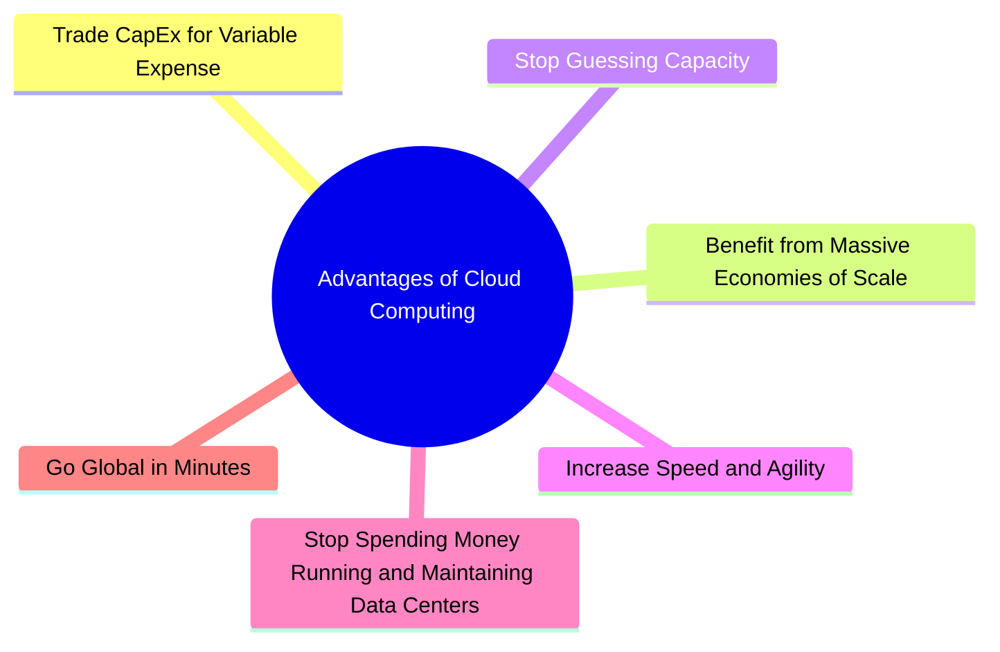

# Advantages of Cloud Computing

---

# Detailed Notes

---
# 1. Trade CapEx for Variable Expense

## Definition

One of the most important advantages of cloud computing is the ability to replace Capital Expenditure (CapEx) with Variable Expense.

Instead of investing large amounts of money upfront to purchase infrastructure, organizations pay only for the resources they actually consume.

This pricing model is commonly known as Pay-As-You-Go.

---

## Traditional IT Approach

Organizations must:

- Purchase servers
- Purchase storage systems
- Purchase networking equipment
- Build data centers

These costs occur before the infrastructure is even used.

This is known as Capital Expenditure (CapEx).

---

## Cloud Computing Approach

Organizations can:

- Launch resources immediately
- Pay only for usage
- Stop paying when resources are terminated

Costs become operational expenses that scale with actual demand.

---

## Benefits

### Lower Financial Risk

No need for large upfront investments.

### Better Cash Flow

Organizations spend money only when resources are consumed.

### Easier Experimentation

New projects can be tested without major investments.

### Reduced Waste

Unused infrastructure is not purchased.

---

## Real-World Example

Traditional IT:

A company predicts it needs ten servers.

It purchases ten servers immediately.

Even if only two servers are used, the company still pays for all ten.

---

Cloud Computing:

The company launches only the resources required.

As demand grows, additional resources can be added.

Costs increase only when usage increases.

---

## CapEx vs Variable Expense

| CapEx | Variable Expense |
|---------|---------|
| Upfront Investment | Pay for Usage |
| Predict Future Demand | Scale with Demand |
| Financial Risk | Lower Risk |
| Traditional IT | Cloud Computing |

---

## Exam Notes

Keywords:

- Upfront Cost
- CapEx
- Pay-As-You-Go
- Variable Expense

Usually indicate this cloud advantage.

---

## Quick Summary

Cloud computing replaces large upfront investments with flexible consumption-based pricing, reducing financial risk and improving cost efficiency.

-------------------------------------------------------------------------------------------------
---

# 2. Benefit from Massive Economies of Scale

## Definition

Cloud providers such as AWS operate at a massive global scale.

Because they serve millions of customers worldwide, they can achieve lower operational costs than individual organizations.

These savings are often passed to customers through lower pricing.

---

## What Are Economies of Scale?

Economies of Scale occur when the cost per unit decreases as the volume of operations increases.

As AWS grows, its cost of providing services becomes lower.

---

## Why AWS Benefits from Scale

AWS purchases:

- Servers
- Storage devices
- Networking equipment
- Power resources

in extremely large quantities.

This allows AWS to negotiate better pricing and operate more efficiently than individual organizations.

---

## Benefits to Customers

### Lower Costs

Customers benefit from AWS pricing advantages.

### Continuous Price Reductions

AWS frequently reduces service prices as efficiency improves.

### Access to Enterprise-Level Infrastructure

Small organizations can access infrastructure that would otherwise be too expensive.

---

## Real-World Example

A small startup cannot negotiate hardware prices like AWS.

AWS purchases infrastructure at global scale and shares those cost efficiencies with customers.

---

## Exam Notes

Keywords:

- Economies of Scale
- Global Scale
- Lower Costs
- Millions of Customers

Usually indicate this cloud advantage.

---

## Quick Summary

AWS achieves lower operating costs through massive global scale and passes many of these savings to customers through lower pricing.
-----------------------------------------------------------------------------------------------------------------------
---

# 3. Stop Guessing Capacity

## Definition

One of the biggest challenges in traditional IT is predicting future infrastructure requirements.

Organizations must estimate how much compute power, storage, and networking capacity they will need months or years in advance.

Cloud computing eliminates much of this uncertainty by allowing resources to scale according to actual demand.

---

## The Traditional IT Problem

Before cloud computing, organizations had to predict:

- Future users
- Future traffic
- Future storage needs
- Future compute requirements

Making incorrect predictions often resulted in either overprovisioning or underprovisioning.

---

## Overprovisioning

### Definition

Overprovisioning occurs when more infrastructure is purchased than required.

### Result

- Wasted money
- Idle resources
- Reduced efficiency

### Example

An application requires 10 servers.

The company purchases 50 servers.

40 servers remain underutilized.

---

## Underprovisioning

### Definition

Underprovisioning occurs when fewer resources are available than required.

### Result

- Performance issues
- Downtime
- Poor customer experience

### Example

An application requires 50 servers.

Only 10 servers are available.

The system becomes overloaded.

---

## Cloud Computing Solution

Cloud resources can be scaled when demand changes.

Organizations no longer need to predict exact future requirements.

Resources can be increased or decreased as needed.

---

## Benefits

### Better Resource Utilization

Resources match actual demand.

### Reduced Waste

Unused infrastructure is minimized.

### Improved Customer Experience

Applications maintain performance during traffic increases.

---

## Real-World Example

Traditional IT:

Buy infrastructure for the busiest day of the year.

Cloud Computing:

Scale infrastructure only when demand increases.

---

## Exam Notes

Keywords:

- Capacity Planning
- Overprovisioning
- Underprovisioning
- Demand Forecasting

Usually indicate this cloud advantage.

---

## Quick Summary

Cloud computing reduces the need for capacity guessing by allowing organizations to scale resources according to actual demand.

---

# 4. Increase Speed and Agility

## Definition

Cloud computing enables organizations to obtain IT resources quickly and respond rapidly to changing business requirements.

Speed refers to how quickly resources can be deployed.

Agility refers to how quickly an organization can adapt to change.

---

## Traditional IT

Launching new infrastructure may require:

- Budget approvals
- Procurement processes
- Hardware delivery
- Installation
- Configuration

This process can take weeks or months.

---

## Cloud Computing

Resources can often be deployed within minutes.

Examples:

- Launch a virtual server
- Create a database
- Allocate storage
- Configure networking

---

## Benefits

### Faster Innovation

Teams can experiment and deploy solutions quickly.

### Faster Time to Market

Applications reach customers sooner.

### Improved Competitiveness

Organizations respond more effectively to business opportunities.

### Increased Productivity

Less time is spent waiting for infrastructure.

---

## Real-World Example

A development team wants to test a new application.

Traditional IT:

May wait weeks for infrastructure.

Cloud Computing:

Can launch the required environment immediately.

---

## Exam Notes

Keywords:

- Agility
- Rapid Deployment
- Faster Innovation
- Time to Market

Usually indicate this cloud advantage.

---

## Quick Summary

Cloud computing significantly increases organizational speed and agility by making resources available on demand.

---

# 5. Stop Spending Money Running and Maintaining Data Centers

## Definition

Traditional IT requires organizations to build, operate, secure, power, cool, and maintain data centers.

Cloud computing allows organizations to transfer many of these responsibilities to cloud providers such as AWS.

---

## Traditional Data Center Costs

Organizations must manage:

- Hardware maintenance
- Power systems
- Cooling systems
- Physical security
- Facility management
- Capacity planning

These activities consume time and resources.

---

## Cloud Computing Solution

AWS manages:

- Data centers
- Physical infrastructure
- Hardware maintenance
- Power systems
- Cooling systems
- Physical security

Organizations can focus on business activities instead.

---

## Benefits

### Reduced Operational Overhead

Less time spent managing infrastructure.

### Reduced Maintenance Costs

Infrastructure management becomes the provider's responsibility.

### Greater Focus on Innovation

Teams focus on customers and products.

---

## Undifferentiated Heavy Lifting

Many infrastructure management activities are necessary but do not directly create business value.

AWS handles much of this undifferentiated heavy lifting.

---

## Exam Notes

Keywords:

- Data Centers
- Maintenance
- Physical Infrastructure
- Undifferentiated Heavy Lifting

Usually indicate this cloud advantage.

---

## Quick Summary

Cloud computing reduces the need to operate and maintain data centers, allowing organizations to focus on business goals.

---

# 6. Go Global in Minutes

## Definition

Cloud computing enables organizations to deploy applications in multiple geographic regions quickly and efficiently.

Instead of building infrastructure around the world, organizations can use the cloud provider's global infrastructure.

---

## Traditional IT

Expanding internationally often requires:

- Purchasing hardware
- Building facilities
- Establishing networking
- Hiring local staff

This process may take months or years.

---

## Cloud Computing

Organizations can deploy resources in multiple AWS Regions within minutes.

Infrastructure already exists and is available on demand.

---

## Benefits

### Global Reach

Applications can serve users worldwide.

### Lower Expansion Costs

No need to build global infrastructure.

### Faster Deployment

Services can be launched rapidly.

### Improved User Experience

Resources can be deployed closer to users.

---

## AWS Global Infrastructure

AWS operates:

- Regions
- Availability Zones
- Edge Locations

These services support global application deployment.

---

## Real-World Example

A company launches an application in Egypt.

Later it wants to serve customers in Europe and North America.

Using AWS, resources can be deployed in additional regions without building new data centers.

---

## Exam Notes

Keywords:

- Global Infrastructure
- AWS Regions
- Worldwide Deployment
- Global Reach

Usually indicate this cloud advantage.

---

# Advantages of Cloud Computing Summary

| Advantage | Main Benefit |
|------------|------------|
| Trade CapEx for Variable Expense | Reduced upfront costs |
| Massive Economies of Scale | Lower operating costs |
| Stop Guessing Capacity | Better resource utilization |
| Increase Speed and Agility | Faster deployment |
| Stop Running Data Centers | Reduced operational overhead |
| Go Global in Minutes | Worldwide deployment |

---

# Common Exam Question

What are the six advantages of cloud computing?

1. Trade CapEx for Variable Expense
2. Benefit from Massive Economies of Scale
3. Stop Guessing Capacity
4. Increase Speed and Agility
5. Stop Spending Money Running and Maintaining Data Centers
6. Go Global in Minutes

---

# End of Advantages of Cloud Computing Section
