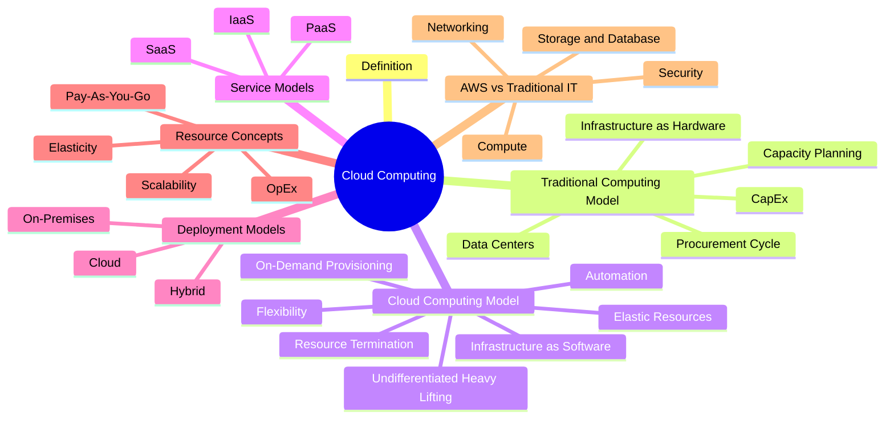

# Cloud Computing


---

# Detailed Notes

---

# 1. Cloud Computing Definition

## Definition

Cloud Computing is the on-demand delivery of computing services over the internet. These services include compute power, storage, databases, networking, software applications, analytics, and other IT resources.

Instead of purchasing, owning, and maintaining physical servers and data centers, organizations can access these resources from a cloud provider whenever they are needed and pay only for what they use.

Cloud computing allows organizations to consume IT resources as services rather than owning and operating physical infrastructure.

### Official AWS Definition

Cloud computing is the on-demand delivery of compute power, database, storage, applications, and other IT resources through the internet with pay-as-you-go pricing.

---

## Why Cloud Computing Exists

Before cloud computing, organizations had to build, own, and maintain their own infrastructure.

This required:

- Purchasing servers
- Building data centers
- Managing networking equipment
- Installing operating systems
- Maintaining hardware
- Planning future capacity

This process was expensive, time-consuming, and difficult to scale.

Cloud computing was introduced to eliminate these limitations by providing resources instantly over the internet without requiring organizations to own physical infrastructure.

---

## Core Components of Cloud Computing

### Compute Power

Compute resources provide the processing capability required to execute applications and workloads.

Examples:

- Hosting websites
- Running APIs
- Processing data
- Machine learning workloads

AWS Examples:

- Amazon EC2
- AWS Lambda

---

### Storage

Storage services provide persistent locations for saving and retrieving data.

Examples:

- Documents
- Images
- Videos
- Backups

AWS Examples:

- Amazon S3
- Amazon EBS
- Amazon EFS

---

### Databases

Databases are used to store, organize, manage, and retrieve information.

Examples:

- Customer records
- Banking transactions
- Product catalogs

AWS Examples:

- Amazon RDS
- Amazon DynamoDB
- Amazon Aurora

---

### Networking

Networking services enable communication between systems, users, and cloud resources.

Examples:

- Routing traffic
- Connecting systems
- Managing communication between services

AWS Examples:

- Amazon VPC
- Route 53
- CloudFront

---

### Applications

Applications are software services delivered through cloud infrastructure.

Examples:

- Email services
- Collaboration tools
- Business applications

---

## Key Characteristics of Cloud Computing

### On-Demand

Resources can be provisioned whenever needed without waiting for hardware procurement.

### Internet-Based

Resources are delivered through the internet.

### Pay-As-You-Go

Customers pay only for the resources they consume.

### Elastic

Resources can automatically increase or decrease according to demand.

### Scalable

Resources can grow to support increasing workloads.

### Managed Infrastructure

The cloud provider manages the physical infrastructure while customers focus on their workloads.

---

## Real-World Example

### Traditional IT

To launch an e-commerce website, a company must:

- Purchase servers
- Install networking equipment
- Build infrastructure
- Predict future traffic
- Maintain hardware

This process may require weeks or months.

### Cloud Computing

Using AWS, the company can:

- Create an AWS account
- Launch resources immediately
- Scale resources automatically
- Pay only for usage

This process can be completed within minutes.

---

## Benefits of Cloud Computing

- Faster deployment
- Lower upfront investment
- Better scalability
- Greater flexibility
- Global availability
- Reduced maintenance effort
- Improved resource utilization

---

## Common Misconceptions

### Misconception

Cloud Computing = Online Storage

### Reality

Cloud Computing includes:

- Compute
- Storage
- Databases
- Networking
- Applications
- Security
- Analytics

Storage is only one component of cloud computing.

---

### Misconception

Cloud Computing removes all management responsibilities.

### Reality

The amount of management depends on the service model being used:

- IaaS
- PaaS
- SaaS

---

## Exam Notes

Keywords commonly associated with Cloud Computing:

- On-Demand
- Pay-As-You-Go
- Elastic Resources
- Scalability
- Managed Infrastructure
- Internet-Based Services

When these keywords appear in AWS exam questions, the answer is often related to cloud computing concepts.

---

## Related Concepts

- Traditional Computing Model
- Infrastructure as Software
- Scalability
- Elasticity
- Service Models
- Deployment Models

---

## Quick Summary

Cloud Computing is the delivery of IT resources over the internet using an on-demand and pay-as-you-go model. It enables organizations to access compute power, storage, databases, networking, and applications without owning physical infrastructure, resulting in greater flexibility, scalability, and cost efficiency.

-----------------------------------------------------------------------------------------------------
---

# 2. Traditional Computing Model

## Definition

The Traditional Computing Model is an approach to information technology where organizations purchase, own, operate, and maintain their own physical infrastructure.

This infrastructure includes servers, storage systems, networking equipment, operating systems, security systems, and data centers.

Before cloud computing became popular, almost every organization used this model to deliver IT services.

In this model, the organization is fully responsible for planning, purchasing, deploying, securing, maintaining, and upgrading all infrastructure components.

---

## Why Organizations Used Traditional IT

Traditional IT was the only practical way to run applications before cloud providers existed.

Organizations built their own infrastructure to:

- Host applications
- Store data
- Manage internal systems
- Support employees
- Deliver services to customers

Owning infrastructure provided full control over systems, hardware, and security.

---

## Infrastructure as Hardware

### Definition

In the traditional model, infrastructure is viewed as physical hardware.

Organizations must purchase and manage physical components rather than consuming resources as services.

Examples include:

- Physical servers
- Storage arrays
- Networking devices
- Firewalls
- Power systems
- Cooling systems

---

### Characteristics

Infrastructure as Hardware requires:

- Physical space
- Skilled personnel
- Physical security
- Long-term planning
- Large financial investment

Every infrastructure upgrade requires purchasing and deploying new hardware.

---

### Responsibilities

Organizations are responsible for:

- Purchasing hardware
- Installing hardware
- Configuring systems
- Replacing failed components
- Managing upgrades
- Monitoring performance
- Maintaining security

---

## Data Centers

### Definition

A Data Center is a physical facility that contains computing infrastructure used to run applications and store data.

Data centers provide the environment required to operate IT systems reliably and securely.

---

### Typical Components

A data center usually contains:

#### Servers

Provide compute power.

#### Storage Systems

Store files and application data.

#### Networking Equipment

Connect systems together.

#### Power Systems

Provide uninterrupted electrical power.

#### Cooling Systems

Prevent hardware overheating.

#### Physical Security Systems

Protect infrastructure from unauthorized access.

---

### Challenges of Data Centers

#### High Cost

Building and operating data centers requires significant investment.

#### Maintenance Requirements

Hardware must be continuously maintained.

#### Limited Flexibility

Expanding infrastructure often requires purchasing additional hardware.

#### Long Deployment Times

New infrastructure may take weeks or months to become operational.

---

## Capital Expenditure (CapEx)

### Definition

Capital Expenditure (CapEx) refers to money spent upfront to purchase, upgrade, or maintain physical assets.

These purchases are considered long-term investments.

---

### Examples of CapEx

- Purchasing servers
- Building data centers
- Buying storage systems
- Purchasing networking equipment

---

### Characteristics of CapEx

#### Large Initial Investment

Organizations must spend significant amounts of money before resources are used.

#### Financial Risk

Future resource requirements may be difficult to predict.

#### Long-Term Commitment

Purchased infrastructure remains owned regardless of actual usage.

---

### Advantages of CapEx

- Full ownership of infrastructure
- Greater customization options
- Long-term asset control

---

### Disadvantages of CapEx

- High upfront costs
- Slow infrastructure expansion
- Risk of purchasing unnecessary resources

---

## Procurement Cycle

### Definition

The Procurement Cycle is the process used to acquire and deploy new infrastructure.

In traditional IT environments, obtaining new resources often requires multiple approval and deployment stages.

---

### Typical Procurement Process

1. Identify requirements
2. Request budget approval
3. Select vendors
4. Purchase hardware
5. Wait for delivery
6. Install equipment
7. Configure systems
8. Deploy workloads

---

### Challenges

#### Slow Deployment

Infrastructure deployment may take weeks or months.

#### Administrative Overhead

Multiple approvals and purchasing processes are required.

#### Reduced Agility

Organizations cannot respond quickly to changing requirements.

---

## Capacity Planning

### Definition

Capacity Planning is the process of estimating future infrastructure requirements.

Organizations attempt to predict future demand before purchasing infrastructure.

---

### What Must Be Estimated?

- Future users
- Future storage requirements
- Future compute requirements
- Future network traffic
- Future business growth

---

## Overprovisioning

### Definition

Overprovisioning occurs when an organization purchases more infrastructure than required.

### Example

An application needs five servers but the company purchases twenty servers.

### Result

- Wasted money
- Idle resources
- Reduced efficiency

---

## Underprovisioning

### Definition

Underprovisioning occurs when an organization purchases fewer resources than required.

### Example

An application requires twenty servers but only five are available.

### Result

- Performance degradation
- Service interruptions
- Poor customer experience

---

## Major Problems with Traditional Computing

### High Upfront Cost

Large investments are required before resources are used.

### Long Procurement Cycles

New infrastructure takes time to acquire and deploy.

### Capacity Guessing

Future demand must be estimated in advance.

### Limited Scalability

Expanding infrastructure requires purchasing additional hardware.

### Maintenance Burden

Organizations must maintain hardware continuously.

---

## Why Cloud Computing Replaced Traditional IT

Cloud computing solves many traditional IT limitations by providing:

- On-demand resources
- Pay-as-you-go pricing
- Rapid deployment
- Elastic scalability
- Reduced maintenance overhead

Instead of purchasing infrastructure, organizations consume resources as services.

---

## Exam Notes

Traditional IT is strongly associated with:

- Data Centers
- Physical Hardware
- CapEx
- Procurement Cycles
- Capacity Planning
- Overprovisioning
- Underprovisioning

When AWS exam questions mention:

- Buying servers
- Long deployment times
- Capacity estimation
- Hardware maintenance

the question is usually describing Traditional IT problems.

---

## Common Mistakes

### Mistake

More servers always means better infrastructure.

### Reality

Overprovisioning creates unnecessary costs.

---

### Mistake

Buying fewer servers saves money.

### Reality

Underprovisioning may cause downtime and customer dissatisfaction.

---

## Quick Summary

Traditional Computing requires organizations to purchase, own, and maintain physical infrastructure. While it provides full control, it introduces challenges such as high upfront costs, long deployment times, maintenance overhead, and capacity planning risks. These limitations were major drivers behind the adoption of cloud computing.
--------------------------------------------------------------------------------------------------------
---

# 3. Cloud Computing Model

## Definition

The Cloud Computing Model is an approach where infrastructure is treated as software rather than hardware.

Instead of purchasing, owning, and maintaining physical resources, organizations provision computing resources on demand through a cloud provider.

Resources can be created, modified, scaled, and terminated whenever needed.

This enables organizations to focus on their business objectives instead of managing infrastructure.

---

## Infrastructure as Software

### Definition

Infrastructure as Software means treating infrastructure resources as configurable services that can be provisioned, modified, and removed through software.

Instead of physically installing hardware, organizations can create resources using management consoles, APIs, scripts, or automation tools.

---

### Traditional IT Approach

To launch a new server:

- Purchase hardware
- Wait for delivery
- Install equipment
- Configure systems
- Deploy workloads

Deployment may take weeks.

---

### Cloud Approach

To launch a new server:

- Sign in to AWS
- Select required resources
- Launch the service

Deployment may take minutes.

---

### Why It Matters

Infrastructure as Software provides:

- Faster deployment
- Greater flexibility
- Easier automation
- Better scalability
- Lower operational overhead

---

## Flexibility

### Definition

Flexibility is the ability to quickly adapt infrastructure resources to changing business and technical requirements.

Organizations can modify infrastructure whenever requirements change.

---

### Examples

- Increase storage capacity
- Launch additional servers
- Deploy applications in new regions
- Add new services

---

### Benefits

- Faster innovation
- Faster response to customer demand
- Reduced operational constraints

---

## On-Demand Provisioning

### Definition

On-Demand Provisioning is the ability to create resources whenever they are needed.

Resources can be provisioned immediately without waiting for procurement processes.

---

### Traditional IT

Provisioning requires:

- Budget approval
- Hardware purchase
- Installation
- Configuration

---

### Cloud Computing

Provisioning requires:

- Selecting a service
- Configuring requirements
- Launching resources

---

### Benefits

- Immediate availability
- Faster deployment
- Improved agility

---

## Resource Termination

### Definition

Resource Termination is the ability to remove resources when they are no longer needed.

Unlike traditional infrastructure, resources do not need to remain permanently available.

---

### Example

A development environment may be needed only during testing.

After testing is completed:

- Resources can be terminated
- Billing stops
- Costs are reduced

---

### Benefits

- Cost optimization
- Reduced waste
- Better resource management

---

## Elastic Resources

### Definition

Elasticity is the ability to automatically increase or decrease resources based on demand.

Resources expand when demand increases and shrink when demand decreases.

---

### Example

Normal Traffic:

```text
2 Servers
```

High Traffic:

```text
20 Servers
```

After Traffic Drops:

```text
2 Servers
```

---

### Benefits

- Improved efficiency
- Better customer experience
- Lower costs

---

## Automation

### Definition

Automation is the use of software and predefined rules to perform infrastructure tasks automatically.

Automation reduces manual effort and improves consistency.

---

### Examples

- Automatic scaling
- Automated deployments
- Automated monitoring
- Automated backups

---

### Benefits

- Reduced human error
- Faster operations
- Improved reliability
- Consistent configurations

---

## Undifferentiated Heavy Lifting

### Definition

Undifferentiated Heavy Lifting refers to infrastructure management tasks that are necessary but do not directly create business value.

These tasks consume time and resources but do not provide competitive advantages.

---

### Examples

- Hardware maintenance
- Capacity planning
- Server replacement
- Power management
- Cooling systems
- Physical security

---

### Traditional IT

Organizations perform these tasks themselves.

---

### Cloud Computing

The cloud provider performs these tasks.

Organizations focus on:

- Customers
- Products
- Innovation
- Business goals

---

### Why It Matters

Developers and IT teams can spend more time building solutions and less time managing infrastructure.

---

## Advantages of Infrastructure as Software

### Faster Deployment

Resources are available within minutes.

### Greater Flexibility

Infrastructure can be modified quickly.

### Lower Costs

Pay only for resources used.

### Automation

Many tasks can be automated.

### Scalability

Resources can grow when needed.

### Elasticity

Resources can shrink when demand decreases.

---

## Traditional IT vs Cloud Computing

| Traditional IT | Cloud Computing |
|----------------|----------------|
| Infrastructure as Hardware | Infrastructure as Software |
| CapEx | OpEx |
| Long Procurement Cycle | On-Demand Provisioning |
| Manual Scaling | Elastic Scaling |
| Hardware Ownership | Resource Consumption |
| Infrastructure Maintenance | Managed Infrastructure |

---

## Exam Notes

When AWS exam questions mention:

- Flexibility
- Automation
- On-Demand Provisioning
- Infrastructure as Software
- Elastic Resources
- Pay Only for What You Use

the correct answer is usually related to Cloud Computing principles.

---

## Common Mistakes

### Mistake

Cloud resources are permanent.

### Reality

Cloud resources can be created and terminated whenever needed.

---

### Mistake

Elasticity and Scalability are the same thing.

### Reality

Scalability increases capacity.

Elasticity increases and decreases capacity automatically according to demand.

---

## Quick Summary

The Cloud Computing Model treats infrastructure as software rather than hardware. Resources can be provisioned, modified, scaled, automated, and terminated on demand. This approach improves flexibility, reduces operational overhead, and allows organizations to focus on business goals instead of infrastructure management.
----------------------------------------------------------------------------------------------------------------
---

# 4. Resource Concepts

Resource Concepts are fundamental ideas that explain how cloud resources are consumed, managed, and optimized.

These concepts are among the most important topics in cloud computing because they directly affect performance, cost, and business efficiency.

---

# 4.1 Scalability

## Definition

Scalability is the ability of a system to increase its capacity in order to handle growing workloads.

A scalable system can support more users, more transactions, more storage requirements, and higher traffic levels without significantly affecting performance.

---

## Why Scalability Exists

Business requirements continuously change.

As organizations grow, their applications must support:

- More users
- More requests
- More data
- More services

Without scalability, systems eventually become overloaded.

---

## Types of Scalability

### Vertical Scaling (Scaling Up)

Vertical scaling means increasing the resources of an existing server.

Examples:

- More CPU
- More RAM
- Faster Storage

Example:

```text
Server
CPU = 4 vCPU
RAM = 8 GB

↓

CPU = 16 vCPU
RAM = 64 GB
```

---

### Advantages of Vertical Scaling

- Easy to implement
- Requires minimal architectural changes

---

### Disadvantages of Vertical Scaling

- Physical limits exist
- Hardware upgrades become expensive
- Single point of failure remains

---

### Horizontal Scaling (Scaling Out)

Horizontal scaling means adding more servers instead of increasing the size of a single server.

Example:

```text
1 Server

↓

10 Servers
```

Traffic is distributed across multiple servers using a load balancer.

---

### Advantages of Horizontal Scaling

- Better fault tolerance
- Higher availability
- Nearly unlimited growth

---

### Disadvantages of Horizontal Scaling

- More complex architecture
- Requires load balancing

---

## Real-World Example

Imagine an online store receiving 100 users daily.

Later it receives 1,000,000 users daily.

The infrastructure must scale to support this increased demand.

---

## AWS Perspective

Examples:

- Amazon EC2 Auto Scaling
- Elastic Load Balancing

---

## Exam Notes

Keywords:

- Increase Capacity
- More Resources
- Growth
- Higher Workloads

Usually indicate Scalability.

---

# 4.2 Elasticity

## Definition

Elasticity is the ability of a system to automatically increase and decrease resources according to current demand.

Elasticity focuses on matching resources to actual workload requirements.

---

## Why Elasticity Exists

Demand is not always constant.

Many applications experience:

- Daily traffic spikes
- Weekly traffic changes
- Seasonal demand
- Unexpected traffic surges

Elasticity prevents paying for unused resources.

---

## How Elasticity Works

### Demand Increases

Resources automatically increase.

Example:

```text
2 Servers

↓

20 Servers
```

---

### Demand Decreases

Resources automatically decrease.

Example:

```text
20 Servers

↓

2 Servers
```

---

## Real-World Example

An online shopping platform during Black Friday:

Before Sale:

```text
5 Servers
```

During Sale:

```text
100 Servers
```

After Sale:

```text
5 Servers
```

---

## Benefits

- Lower costs
- Better resource utilization
- Improved customer experience

---

## AWS Perspective

Examples:

- EC2 Auto Scaling
- AWS Auto Scaling

---

## Scalability vs Elasticity

| Scalability | Elasticity |
|-------------|------------|
| Increase capacity | Increase and decrease capacity |
| Focus on growth | Focus on demand matching |
| Can be manual | Often automated |
| Long-term focus | Short-term focus |

---

## Exam Trap

Many students think:

```text
Scalability = Elasticity
```

This is incorrect.

Scalability focuses on growth.

Elasticity focuses on automatic adjustment based on demand.

---

# 4.3 Pay-As-You-Go

## Definition

Pay-As-You-Go is a pricing model where customers pay only for the resources they consume.

There are no large upfront investments.

Costs are directly related to usage.

---

## Traditional IT

Organizations purchase infrastructure before it is needed.

Costs are incurred regardless of utilization.

---

## Cloud Computing

Resources are billed according to actual consumption.

Examples:

- Compute usage
- Storage usage
- Database usage
- Network usage

---

## Benefits

- Cost efficiency
- Financial flexibility
- Reduced waste

---

## Real-World Example

Electricity billing:

You pay for the electricity you use.

Cloud computing works similarly.

---

## AWS Perspective

Most AWS services follow the Pay-As-You-Go model.

Examples:

- Amazon EC2
- Amazon S3
- Amazon RDS

---

# 4.4 Operational Expenditure (OpEx)

## Definition

Operational Expenditure (OpEx) refers to ongoing expenses incurred during normal business operations.

In cloud computing, OpEx means paying for resources as they are consumed rather than purchasing infrastructure upfront.

---

## Examples

- AWS monthly bills
- Storage charges
- Compute charges
- Database charges

---

## Characteristics

### Consumption-Based

Pay only for actual usage.

### Flexible

Costs change according to demand.

### Lower Upfront Investment

No need to purchase infrastructure in advance.

---

## OpEx vs CapEx

| CapEx | OpEx |
|--------|-------|
| Large upfront investment | Ongoing operational cost |
| Purchase infrastructure | Consume services |
| Long-term ownership | Pay for usage |
| Traditional IT | Cloud Computing |

---

## Why AWS Prefers OpEx

OpEx allows organizations to:

- Reduce financial risk
- Increase flexibility
- Launch projects faster
- Scale more efficiently

---

## Exam Notes

When AWS exam questions mention:

- Pay only for what you use
- No upfront investment
- Consumption-based pricing

The answer is usually related to:

- Pay-As-You-Go
- OpEx

---

## Quick Summary

Resource Concepts explain how cloud resources are managed and consumed. Scalability enables growth, Elasticity automatically adjusts resources to demand, Pay-As-You-Go charges based on usage, and OpEx replaces large upfront investments with flexible operational spending.
------------------------------------------------------------------------------------------------------------------
---

# 5. Cloud Service Models

## Definition

Cloud Service Models define how cloud services are delivered to customers.

Each model provides a different level of:

- Control
- Responsibility
- Flexibility
- Management

As you move from IaaS to SaaS, your responsibility decreases while the cloud provider's responsibility increases.

---

## Why Service Models Exist

Not every organization wants the same level of control.

Some organizations want complete control over infrastructure.

Others only want to deploy applications.

Some simply want to use software without managing anything.

Cloud Service Models provide different options to meet these requirements.

---

# 5.1 Infrastructure as a Service (IaaS)

## Definition

Infrastructure as a Service (IaaS) provides the fundamental building blocks of cloud computing.

It gives customers access to:

- Virtual Servers
- Storage
- Networking
- Computing Resources

while the cloud provider manages the physical infrastructure.

---

## Responsibility Model

### AWS Manages

- Data Centers
- Physical Servers
- Networking Hardware
- Storage Hardware

### Customer Manages

- Operating System
- Applications
- Security Configuration
- Data
- Runtime Environment

---

## Characteristics

### Highest Level of Control

Customers have significant control over resources.

### Highest Flexibility

Infrastructure can be configured according to business requirements.

### Closest to Traditional IT

IaaS resembles traditional infrastructure but without owning hardware.

---

## AWS Examples

- Amazon EC2
- Amazon EBS
- Amazon EFS
- Amazon VPC

---

## Real-World Example

Renting an empty apartment.

The building owner provides:

- Building
- Electricity
- Infrastructure

You are responsible for:

- Furniture
- Decoration
- Daily usage

---

## Advantages

- High flexibility
- High customization
- Full operating system control

---

## Disadvantages

- More management responsibilities
- More configuration effort

---

## Exam Notes

Keywords:

- Maximum Control
- Virtual Machines
- Infrastructure
- Operating System Management

Usually indicate IaaS.

---

# 5.2 Platform as a Service (PaaS)

## Definition

Platform as a Service (PaaS) provides a managed platform for developing, deploying, and managing applications.

Customers focus primarily on application development while the cloud provider manages most infrastructure components.

---

## Responsibility Model

### AWS Manages

- Infrastructure
- Servers
- Storage
- Networking
- Operating Systems
- Runtime Environment

### Customer Manages

- Application Code
- Application Configuration
- Business Logic

---

## Characteristics

### Reduced Infrastructure Management

Developers spend less time managing infrastructure.

### Faster Development

Applications can be deployed quickly.

### Focus on Development

Teams focus on code instead of servers.

---

## AWS Examples

- AWS Elastic Beanstalk

---

## Real-World Example

Renting a fully furnished apartment.

The owner provides:

- Building
- Furniture
- Utilities

You simply move in and use it.

---

## Advantages

- Faster deployment
- Reduced management overhead
- Increased productivity

---

## Disadvantages

- Less flexibility than IaaS
- Less control over infrastructure

---

## Exam Notes

Keywords:

- Deploy Applications
- Managed Platform
- Application Development

Usually indicate PaaS.

---

# 5.3 Software as a Service (SaaS)

## Definition

Software as a Service (SaaS) provides fully managed software applications to end users.

Customers simply use the software without managing infrastructure or platforms.

---

## Responsibility Model

### Provider Manages

- Infrastructure
- Operating Systems
- Runtime
- Application Maintenance
- Security Updates
- Software Updates

### Customer Manages

- Software Usage
- User Configuration

---

## Characteristics

### Lowest Management Responsibility

Customers focus only on using the software.

### Fastest Adoption

Services can often be used immediately.

### Fully Managed

No infrastructure management is required.

---

## Examples

- Gmail
- Outlook 365
- Zoom
- Salesforce

---

## AWS Example

Many AWS managed business services operate similarly to SaaS solutions.

---

## Real-World Example

Staying in a hotel.

The hotel manages:

- Building
- Furniture
- Utilities
- Cleaning
- Maintenance

You simply use the service.

---

## Advantages

- No infrastructure management
- Rapid deployment
- Minimal technical expertise required

---

## Disadvantages

- Least customization
- Least control

---

## Exam Notes

Keywords:

- End User Application
- Fully Managed Software
- Web-Based Email

Usually indicate SaaS.

---

# Service Model Comparison

| Feature | IaaS | PaaS | SaaS |
|----------|----------|----------|----------|
| Customer Control | High | Medium | Low |
| Customer Responsibility | High | Medium | Low |
| Flexibility | High | Medium | Low |
| Infrastructure Management | Customer | Provider | Provider |
| Operating System Management | Customer | Provider | Provider |
| Application Management | Customer | Customer | Provider |
| Typical User | System Administrator | Developer | End User |

---

# Control Hierarchy

```text
More Control
    │
    ▼

IaaS

    ▼

PaaS

    ▼

SaaS

    ▼

Less Control
```

---

# Which Model Should You Choose?

## Choose IaaS When

- You need maximum control.
- You want to manage operating systems.
- You require custom infrastructure.

---

## Choose PaaS When

- You want to focus on development.
- You want less infrastructure management.
- You need rapid application deployment.

---

## Choose SaaS When

- You only need to use software.
- You do not want to manage infrastructure.
- You want the fastest implementation.

---

# Common Exam Traps

### Trap 1

More Management = Better Service

Incorrect.

The best model depends on business requirements.

---

### Trap 2

SaaS Is Always Better

Incorrect.

Some applications require infrastructure control.

---

### Trap 3

IaaS, PaaS, and SaaS Are Different Technologies

Incorrect.

They are different service delivery models.

---

# Quick Summary

Cloud Service Models determine how cloud services are delivered and managed.

- IaaS provides infrastructure and maximum control.
- PaaS provides a managed platform for developers.
- SaaS provides fully managed software for end users.

Responsibility decreases as you move from IaaS to SaaS, while provider management increases.
--------------------------------------------------------------------------------------------------
---

# 6. Cloud Deployment Models

## Definition

Cloud Deployment Models define where applications and infrastructure resources are deployed and how they are made available to users.

Different deployment models provide different levels of flexibility, control, security, and cloud integration.

AWS identifies three primary deployment models:

- Cloud
- Hybrid
- On-Premises (Private Cloud)

---

# 6.1 Cloud Deployment Model

## Definition

In the Cloud Deployment Model, all components of an application run entirely in the cloud.

Infrastructure, storage, networking, databases, and applications are hosted by a cloud provider.

---

## Characteristics

- Fully cloud-based
- No local infrastructure required
- Maximum cloud benefits
- High scalability
- High flexibility

---

## Advantages

- Rapid deployment
- Elastic scalability
- Lower infrastructure costs
- Global availability

---

## AWS Example

Application hosted entirely on:

- Amazon EC2
- Amazon RDS
- Amazon S3

without any on-premises infrastructure.

---

## Typical Use Cases

- Startups
- Cloud-native applications
- SaaS platforms

---

# 6.2 Hybrid Deployment Model

## Definition

Hybrid Deployment combines cloud resources with existing on-premises infrastructure.

Some components run in the cloud while others remain inside the organization's data center.

---

## Characteristics

- Combines cloud and on-premises resources
- Gradual cloud adoption
- Integration with legacy systems

---

## Advantages

- Flexibility
- Easier migration
- Retain existing investments
- Regulatory compliance support

---

## AWS Example

Customer database remains on-premises.

Web application runs on AWS.

Both environments communicate together.

---

## Typical Use Cases

- Large enterprises
- Government organizations
- Organizations with legacy systems

---

# 6.3 On-Premises Deployment Model

## Definition

The On-Premises Deployment Model uses infrastructure located entirely within an organization's facilities.

Resources are owned and managed by the organization.

This model is sometimes called a Private Cloud when virtualization technologies are used.

---

## Characteristics

- Full infrastructure ownership
- Dedicated resources
- Maximum internal control

---

## Advantages

- Greater control
- Dedicated infrastructure
- Internal governance

---

## Disadvantages

- High CapEx
- Maintenance responsibility
- Limited flexibility
- Limited scalability

---

## Typical Use Cases

- Highly regulated industries
- Specialized workloads
- Legacy applications

---

# Deployment Models Comparison

| Feature | Cloud | Hybrid | On-Premises |
|----------|----------|----------|----------|
| Infrastructure Location | Cloud Provider | Mixed | Organization |
| Scalability | High | Medium | Limited |
| Flexibility | High | Medium | Low |
| Upfront Cost | Low | Medium | High |
| Maintenance Effort | Low | Medium | High |
| Cloud Benefits | Full | Partial | Minimal |

---

# How to Choose a Deployment Model

## Choose Cloud When

- Maximum agility is required
- Rapid scaling is needed
- Infrastructure management should be minimized

---

## Choose Hybrid When

- Existing infrastructure must remain
- Gradual migration is preferred
- Legacy applications exist

---

## Choose On-Premises When

- Dedicated infrastructure is required
- Regulatory requirements exist
- Full control is necessary

---

# Common Exam Traps

### Trap 1

Hybrid means partially migrated infrastructure.

Correct.

---

### Trap 2

Cloud means some resources are on-premises.

Incorrect.

Cloud deployment means the application runs entirely in the cloud.

---

### Trap 3

On-Premises automatically means better security.

Incorrect.

Security depends on implementation, not deployment model.

---

# Quick Summary

Cloud Deployment Models define where resources are deployed.

- Cloud = Everything in the cloud.
- Hybrid = Cloud + On-Premises.
- On-Premises = Everything inside the organization.

Each model provides different levels of flexibility, control, scalability, and operational responsibility.
---------------------------------------------------------------------------------------------------------
---

# 7. AWS vs Traditional IT

## Introduction

One of the primary reasons cloud computing became widely adopted is its ability to solve many limitations of traditional IT infrastructure.

Traditional IT requires organizations to purchase, deploy, maintain, and manage their own infrastructure.

AWS provides cloud services that replace much of this operational burden.

The comparison between AWS and Traditional IT can be analyzed through four major areas:

- Compute
- Storage & Databases
- Networking
- Security

---

# 7.1 Compute

## Traditional IT

To add compute capacity, organizations must:

- Purchase physical servers
- Wait for hardware delivery
- Install equipment
- Configure operating systems
- Maintain hardware

This process may require weeks or months.

---

## AWS

Compute resources can be provisioned within minutes.

Examples:

- Amazon EC2
- AWS Lambda
- AWS Elastic Beanstalk

Resources can be increased or decreased on demand.

---

## Comparison

| Traditional IT | AWS |
|---------------|------|
| Physical Servers | Virtual Servers |
| Manual Deployment | On-Demand Deployment |
| Long Procurement Cycle | Minutes |
| Fixed Capacity | Elastic Capacity |

---

# 7.2 Storage and Databases

## Traditional IT

Organizations must:

- Purchase storage hardware
- Install storage systems
- Maintain storage infrastructure
- Plan future storage capacity

Database servers must also be deployed and maintained.

---

## AWS Storage Services

### Amazon S3

Object storage service.

### Amazon EBS

Block storage service.

### Amazon EFS

Shared file storage service.

---

## AWS Database Services

### Amazon RDS

Managed relational database service.

### Amazon DynamoDB

Managed NoSQL database service.

### Amazon Aurora

High-performance relational database.

### Amazon Redshift

Data warehouse service.

---

## Comparison

| Traditional IT | AWS |
|---------------|------|
| Buy Storage Hardware | Provision Storage Instantly |
| Manual Expansion | On-Demand Expansion |
| Manual Database Management | Managed Database Services |
| Capacity Planning Required | Elastic Resources |

---

# 7.3 Networking

## Traditional IT

Networking requires:

- Physical routers
- Physical switches
- Firewall appliances
- Manual configuration

Infrastructure changes may require hardware purchases.

---

## AWS Networking Services

### Amazon VPC

Virtual Private Cloud.

Provides logically isolated networks inside AWS.

### Amazon Route 53

DNS and domain management service.

### Amazon CloudFront

Content Delivery Network (CDN).

### Elastic Load Balancer (ELB)

Distributes traffic across resources.

---

## Comparison

| Traditional IT | AWS |
|---------------|------|
| Physical Networking Equipment | Virtual Networking |
| Hardware Installation | Software-Based Provisioning |
| Long Deployment Times | Rapid Deployment |
| Limited Flexibility | High Flexibility |

---

# 7.4 Security

## Traditional IT

Organizations are responsible for:

- Physical security
- Infrastructure security
- Identity management
- Access control
- Security monitoring

Everything must be implemented and maintained internally.

---

## AWS Security Services

### AWS Identity and Access Management (IAM)

Controls authentication and authorization.

### Amazon Cognito

Provides user authentication services.

### AWS Key Management Service (KMS)

Manages encryption keys.

---

## Shared Responsibility Model

AWS follows a Shared Responsibility Model.

### AWS Responsible For

Security OF the Cloud:

- Physical infrastructure
- Data centers
- Hardware
- Global infrastructure

### Customer Responsible For

Security IN the Cloud:

- User permissions
- Data protection
- Resource configuration
- Application security

---

## Comparison

| Traditional IT | AWS |
|---------------|------|
| Full Security Responsibility | Shared Responsibility |
| Physical Security Required | AWS Manages Physical Security |
| Manual Identity Management | IAM |
| Manual Key Management | KMS |

---

# Traditional IT vs AWS Summary

| Category | Traditional IT | AWS |
|-----------|---------------|------|
| Infrastructure | Hardware | Software |
| Pricing | CapEx | OpEx |
| Resource Provisioning | Weeks or Months | Minutes |
| Scaling | Manual | Elastic |
| Capacity Planning | Required | Reduced |
| Maintenance | Customer | Shared |
| Flexibility | Limited | High |
| Global Reach | Limited | Global |

---

# Why Organizations Choose AWS

Organizations adopt AWS because it provides:

- Faster deployment
- Lower upfront costs
- Elastic scalability
- Global infrastructure
- Managed services
- Improved agility
- Reduced operational overhead

Instead of managing infrastructure, organizations can focus on innovation and business objectives.

---

# Common Exam Traps

### Trap 1

AWS completely removes customer security responsibilities.

Incorrect.

AWS uses a Shared Responsibility Model.

---

### Trap 2

Cloud computing eliminates all management activities.

Incorrect.

Customers still manage resources, permissions, and data.

---

### Trap 3

AWS only provides virtual servers.

Incorrect.

AWS provides hundreds of services across compute, storage, networking, security, analytics, AI, and many other categories.

---

# Quick Summary

AWS transforms traditional infrastructure management by providing cloud services that can be provisioned on demand. Compared with traditional IT, AWS offers greater flexibility, faster deployment, elastic scalability, reduced operational overhead, and a pay-as-you-go pricing model.
-----------------------------------------------------------------------------------------------------------------------------------
---

# Module Summary

This section introduced the fundamental concepts of cloud computing.

Topics covered:

- Cloud Computing Definition
- Traditional Computing Model
- Cloud Computing Model
- Resource Concepts
- Cloud Service Models
- Cloud Deployment Models
- AWS vs Traditional IT

Understanding these concepts provides the foundation required for learning AWS services and cloud architecture.

---

# Key Terms Glossary

| Term | Definition |
|--------|------------|
| Cloud Computing | Delivery of IT resources over the internet on demand |
| Scalability | Ability to increase capacity |
| Elasticity | Ability to increase and decrease capacity automatically |
| CapEx | Upfront infrastructure investment |
| OpEx | Consumption-based operational spending |
| IaaS | Infrastructure as a Service |
| PaaS | Platform as a Service |
| SaaS | Software as a Service |
| On-Demand | Resources available whenever needed |
| Data Center | Facility containing IT infrastructure |
| Provisioning | Creating and configuring resources |
| Hybrid | Combination of cloud and on-premises resources |

---

# End of Cloud Computing Section
