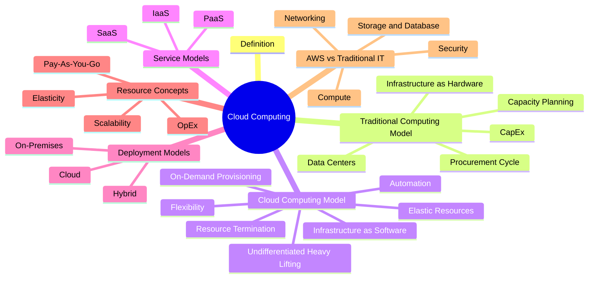

# Cloud Computing

```mermaid
mindmap
  root((Cloud Computing))

    Definition

    Traditional Computing Model
      Infrastructure as Hardware
      Data Centers
      CapEx
      Procurement Cycle
      Capacity Planning

    Cloud Computing Model
      Infrastructure as Software
      Flexibility
      Automation
      On-Demand Provisioning
      Elastic Resources
      Resource Termination
      Undifferentiated Heavy Lifting

    Service Models
      IaaS
      PaaS
      SaaS

    Deployment Models
      Cloud
      Hybrid
      On-Premises

    Resource Concepts
      Scalability
      Elasticity
      Pay-As-You-Go
      OpEx

    AWS vs Traditional IT
      Security
      Networking
      Compute
      Storage and Database
```
