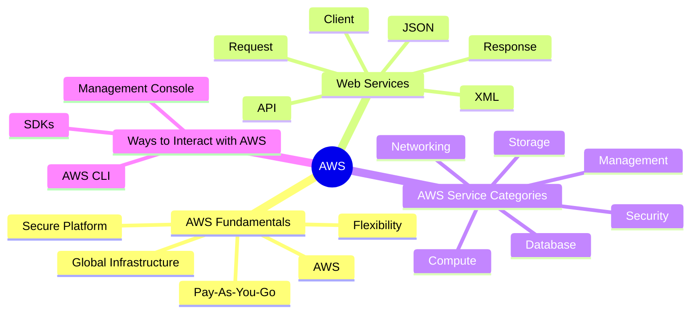

# Introduction to AWS



---

# Detailed Notes

---
# 1. AWS Fundamentals

## What is AWS?

Amazon Web Services (AWS) is a cloud computing platform provided by Amazon.

AWS offers a broad collection of cloud services that help organizations build, deploy, and manage applications without owning physical infrastructure.

AWS provides services in areas such as:

- Compute
- Storage
- Databases
- Networking
- Security
- Analytics
- Artificial Intelligence
- Machine Learning
- Application Development

AWS is currently one of the largest cloud providers in the world.

---

## Why Organizations Use AWS

Organizations choose AWS because it provides:

- On-demand resources
- Global infrastructure
- High availability
- Scalability
- Elasticity
- Pay-as-you-go pricing
- Managed services

AWS allows businesses to focus on innovation instead of infrastructure management.

---

## Core Characteristics of AWS

### On-Demand Resources

Resources can be provisioned whenever needed.

### Pay-As-You-Go Pricing

Customers pay only for the resources they consume.

### Global Reach

Services are available across multiple geographic regions.

### Managed Infrastructure

AWS manages physical infrastructure on behalf of customers.

### Security

AWS provides extensive security services and controls.

---

## Real-World Example

Instead of purchasing servers and building a data center, a startup can use AWS services to:

- Launch applications
- Store data
- Manage databases
- Secure resources

within minutes.

---

## Exam Notes

Keywords:

- Cloud Platform
- On-Demand Services
- Pay-As-You-Go
- Global Infrastructure

usually indicate AWS concepts.

---

## Quick Summary

AWS is Amazon's cloud computing platform that provides on-demand IT resources through a global infrastructure using a pay-as-you-go pricing model.
-----------------------------------------
---

# 2. AWS Global Infrastructure

## Definition

AWS Global Infrastructure is the worldwide network of AWS facilities that deliver cloud services to customers.

It is designed to provide:

- High Availability
- Fault Tolerance
- Low Latency
- Global Reach

AWS delivers services through:

- Regions
- Availability Zones (AZs)
- Edge Locations

---

## AWS Regions

### Definition

A Region is a geographic area that contains multiple AWS data centers.

Each AWS Region is isolated from other Regions.

Examples:

- US East
- Europe
- Middle East
- Asia Pacific

---

### Why Regions Exist

Regions allow customers to:

- Deploy applications closer to users
- Meet compliance requirements
- Improve availability
- Reduce latency

---

## Availability Zones (AZs)

### Definition

An Availability Zone is one or more physically separate data centers within a Region.

Each Availability Zone has:

- Independent power
- Independent cooling
- Independent networking

---

### Purpose

Availability Zones improve:

- Reliability
- High Availability
- Disaster Recovery

---

### Example

```text
Region
│
├── AZ 1
├── AZ 2
└── AZ 3
```

Applications can be distributed across multiple AZs.

---

## Edge Locations

### Definition

Edge Locations are sites used to deliver content closer to end users.

They support services such as:

- Amazon CloudFront
- Route 53

---

### Benefits

- Lower latency
- Faster content delivery
- Better user experience

---

## AWS Global Infrastructure Hierarchy

```text
AWS Global Infrastructure

├── Regions
│
├── Availability Zones
│
└── Edge Locations
```

---

## Exam Notes

Region = Geographic Area

Availability Zone = One or More Data Centers

Edge Location = Content Delivery Site

This distinction appears frequently in AWS exams.

---

## Quick Summary

AWS Global Infrastructure consists of Regions, Availability Zones, and Edge Locations that work together to provide highly available and globally distributed cloud services.
--------------------------------------------------------------------
---

# 3. Web Services

## Definition

AWS services are delivered as Web Services.

A Web Service is a software system that allows applications to communicate with each other over a network using standardized protocols.

Web Services enable clients to interact with AWS resources programmatically.

---

## Why Web Services Matter

Without Web Services, applications would have difficulty communicating with cloud resources.

Web Services provide a standard way to:

- Send requests
- Receive responses
- Exchange data
- Automate operations

---

## Client

### Definition

A Client is any application, device, or user that requests a service.

Examples:

- Web Browser
- Mobile Application
- Desktop Application
- AWS CLI
- SDK Application

---

## Request

### Definition

A Request is a message sent by a client to a service asking for an operation to be performed.

Examples:

- Create EC2 Instance
- Upload File to S3
- Create Database
- Query Data

---

## API

### Definition

API (Application Programming Interface) is a set of rules that allows software applications to communicate with each other.

AWS services expose APIs that allow customers to interact with resources.

---

### Why APIs Are Important

APIs enable:

- Automation
- Integration
- Application Development
- Infrastructure Management

Almost every AWS operation ultimately uses an API call.

---

## Response

### Definition

A Response is the information returned by a service after processing a request.

Responses may contain:

- Success Messages
- Errors
- Resource Information
- Data Results

---

## Request-Response Flow

```text
Client
   │
   ▼
Request
   │
   ▼
AWS API
   │
   ▼
Response
```

---

## XML

### Definition

XML (eXtensible Markup Language) is a markup language used to structure and exchange data.

Historically, many web services used XML as their primary communication format.

---

### Example

```xml
<User>
    <Name>Ahmed</Name>
</User>
```

---

## JSON

### Definition

JSON (JavaScript Object Notation) is a lightweight data-interchange format.

JSON is easier to read and is widely used in modern APIs.

---

### Example

```json
{
  "Name": "Ahmed"
}
```

---

## XML vs JSON

| XML | JSON |
|------|------|
| More Verbose | More Compact |
| Older Format | Modern Format |
| Harder to Read | Easier to Read |
| Larger Size | Smaller Size |

---

## AWS and JSON

Most modern AWS services commonly use JSON for API communication.

---

## Exam Notes

Keywords:

- API
- Request
- Response
- Client
- JSON
- XML

usually refer to Web Services concepts.

---

## Quick Summary

AWS services are delivered through Web Services that use APIs. Clients send requests to AWS services and receive responses. Data is commonly exchanged using formats such as JSON and XML.
---------------------------------------------------------------------
---

# 4. AWS Service Categories

## Definition

AWS provides hundreds of cloud services.

To make them easier to understand, AWS groups services into categories based on their purpose.

The most common categories are:

- Compute
- Storage
- Database
- Networking
- Security
- Management

---

## Compute

### Definition

Compute services provide processing power used to run applications and workloads.

### Examples

- Amazon EC2
- AWS Lambda
- AWS Elastic Beanstalk

### Use Cases

- Web Applications
- APIs
- Data Processing
- Machine Learning

---

## Storage

### Definition

Storage services store and retrieve data.

### Examples

- Amazon S3
- Amazon EBS
- Amazon EFS

### Use Cases

- Backups
- File Storage
- Media Storage

---

## Database

### Definition

Database services store and manage structured and unstructured data.

### Examples

- Amazon RDS
- DynamoDB
- Aurora
- Redshift

### Use Cases

- Customer Records
- Transactions
- Analytics

---

## Networking

### Definition

Networking services connect resources and manage communication.

### Examples

- Amazon VPC
- Route 53
- CloudFront
- ELB

### Use Cases

- Network Isolation
- DNS Management
- Traffic Distribution

---

## Security

### Definition

Security services protect AWS resources and data.

### Examples

- IAM
- Cognito
- KMS

### Use Cases

- Authentication
- Authorization
- Encryption

---

## Management

### Definition

Management services help monitor and manage AWS resources.

### Examples

- CloudWatch
- CloudTrail
- Trusted Advisor

### Use Cases

- Monitoring
- Logging
- Auditing
- Optimization

---

## Service Categories Overview

| Category | Purpose |
|------------|------------|
| Compute | Run Applications |
| Storage | Store Data |
| Database | Manage Data |
| Networking | Connect Resources |
| Security | Protect Resources |
| Management | Monitor Resources |

---

## Exam Notes

Don't memorize every AWS service.

Focus on understanding which category each service belongs to.

---

## Quick Summary

AWS services are grouped into categories that help customers choose the right service for specific business and technical requirements.
----------------------------------------------------------------------------
---

# 5. Ways to Interact with AWS

## Introduction

AWS provides multiple methods for interacting with cloud resources.

Customers can manage AWS services through:

- AWS Management Console
- AWS Command Line Interface (CLI)
- Software Development Kits (SDKs)

Each method serves different use cases and user preferences.

---

# 5.1 AWS Management Console

## Definition

The AWS Management Console is a web-based graphical interface that allows users to manage AWS services through a browser.

It is the most beginner-friendly way to interact with AWS.

---

## Characteristics

### Graphical Interface

Users interact through buttons, menus, and forms.

### Easy to Learn

No programming knowledge is required.

### Visual Resource Management

Resources can be created and managed visually.

---

## Advantages

- User-friendly
- Easy navigation
- Ideal for beginners
- Fast learning curve

---

## Disadvantages

- Less efficient for repetitive tasks
- Difficult to automate
- Slower than programmatic methods

---

## Typical Users

- Students
- Beginners
- Administrators
- Cloud Engineers

---

## Example

Creating an EC2 instance through:

```text
AWS Console
→ EC2
→ Launch Instance
```

---

# 5.2 AWS Command Line Interface (AWS CLI)

## Definition

AWS CLI is a command-line tool that allows users to interact with AWS services by typing commands.

The CLI communicates directly with AWS APIs.

---

## Characteristics

### Text-Based Interface

Operations are performed through commands.

### Faster Automation

Tasks can be scripted and repeated.

### API Integration

Commands are translated into AWS API requests.

---

## Example

List S3 Buckets:

```bash
aws s3 ls
```

Launch EC2 Instance:

```bash
aws ec2 run-instances
```

---

## Advantages

- Faster than the Console
- Supports automation
- Suitable for large environments
- Useful for scripting

---

## Disadvantages

- Requires learning commands
- Less beginner-friendly

---

## Typical Users

- Cloud Engineers
- DevOps Engineers
- System Administrators

---

# 5.3 Software Development Kits (SDKs)

## Definition

AWS SDKs allow developers to interact with AWS services using programming languages.

SDKs provide libraries that simplify communication with AWS APIs.

---

## Supported Languages

Examples:

- Python
- Java
- JavaScript
- C#
- Go
- PHP

---

## Example

Python SDK (Boto3):

```python
import boto3

s3 = boto3.client('s3')

response = s3.list_buckets()

print(response)
```

---

## Advantages

- Full automation
- Application integration
- Developer-friendly
- Supports custom solutions

---

## Disadvantages

- Requires programming knowledge
- More complex than Console

---

## Typical Users

- Software Developers
- Automation Engineers
- DevOps Engineers

---

# Console vs CLI vs SDK

| Feature | Console | CLI | SDK |
|----------|----------|----------|----------|
| Interface | Graphical | Command Line | Programming |
| Easy for Beginners | Yes | Moderate | No |
| Automation | Limited | Good | Excellent |
| Programming Required | No | No | Yes |
| Speed | Moderate | Fast | Fastest |

---

# Which Method Should You Use?

## Use the Console When

- Learning AWS
- Exploring services
- Performing occasional tasks

---

## Use the CLI When

- Automating operations
- Managing many resources
- Working in DevOps environments

---

## Use SDKs When

- Building applications
- Integrating AWS services
- Creating custom automation

---

# Exam Notes

Management Console:
- Graphical Interface
- Beginner Friendly

AWS CLI:
- Command-Based
- Automation

SDK:
- Programming Languages
- Application Integration

These distinctions frequently appear in AWS certification exams.

---

# Introduction to AWS Summary

Topics covered:

- AWS Fundamentals
- AWS Global Infrastructure
- Web Services
- AWS Service Categories
- Ways to Interact with AWS

These concepts form the foundation for understanding AWS services and cloud architecture.

---

# Key Terms Glossary

| Term | Definition |
|--------|------------|
| AWS | Amazon Web Services cloud platform |
| Region | Geographic area containing AWS infrastructure |
| Availability Zone | One or more data centers within a Region |
| Edge Location | Content delivery site |
| API | Interface for software communication |
| Request | Message sent to a service |
| Response | Message returned by a service |
| JSON | Lightweight data exchange format |
| XML | Structured markup language |
| Console | Graphical AWS interface |
| CLI | Command-line AWS interface |
| SDK | Programming libraries for AWS |

---

# End of Introduction to AWS Section
