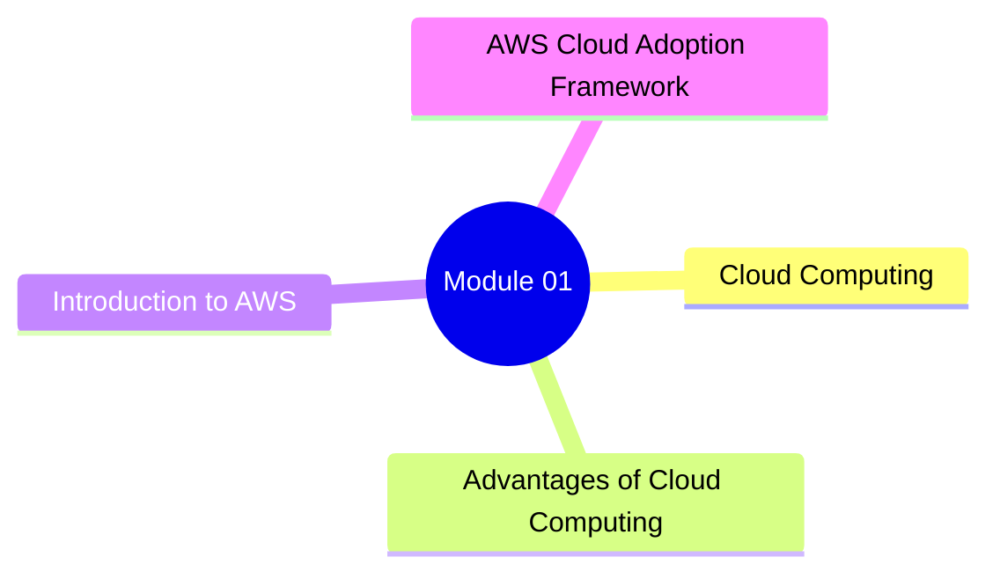

# Module 01 - Cloud Concepts Overview

## Master Map

## Knowledge Maps

- [Cloud Computing](./Cloud-Computing-Map.md)
- [Advantages of Cloud Computing](./Advantages-of-Cloud-Map.md)
- [Introduction to AWS](./Introduction-to-AWS-Map.md)
- [AWS Cloud Adoption Framework (CAF)](./AWS-CAF-Map.md)
