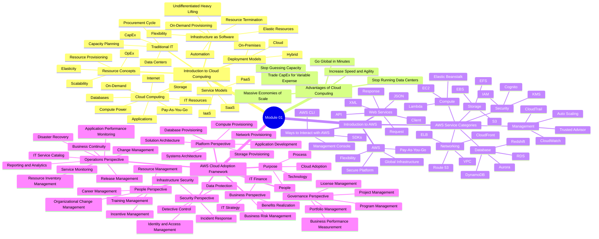

# Module 01 - Cloud Concepts Overview

```mermaid
mindmap
  root((Module 01))

    Introduction to Cloud Computing

      Cloud Computing
        Compute Power
        Storage
        Databases
        Applications
        IT Resources
        Internet
        On-Demand
        Pay-As-You-Go

      Traditional IT
        Data Centers
        Procurement Cycle
        Capacity Planning
        CapEx

      Infrastructure as Software
        Flexibility
        Automation
        On-Demand Provisioning
        Elastic Resources
        Resource Termination
        Undifferentiated Heavy Lifting

      Service Models
        IaaS
        PaaS
        SaaS

      Deployment Models
        Cloud
        Hybrid
        On-Premises

      Resource Concepts
        Scalability
        Elasticity
        Resource Provisioning
        OpEx

    Advantages of Cloud Computing

      Trade CapEx for Variable Expense

      Massive Economies of Scale

      Stop Guessing Capacity

      Increase Speed and Agility

      Stop Running Data Centers

      Go Global in Minutes

    Introduction to AWS

      AWS
        Global Infrastructure
        Secure Platform
        Pay-As-You-Go
        Flexibility

      Web Services
        Client
        Request
        API
        Response
        XML
        JSON

      AWS Service Categories

        Compute
          EC2
          Lambda
          Elastic Beanstalk

        Storage
          S3
          EBS
          EFS

        Database
          RDS
          DynamoDB
          Aurora
          Redshift

        Networking
          VPC
          Route 53
          CloudFront
          ELB

        Security
          IAM
          Cognito
          KMS

        Management
          CloudWatch
          CloudTrail
          Trusted Advisor
          Auto Scaling

      Ways to Interact with AWS
        Management Console
        AWS CLI
        SDKs

    AWS Cloud Adoption Framework

      Purpose
        Cloud Adoption
        People
        Process
        Technology

      Business Perspective
        IT Finance
        IT Strategy
        Benefits Realization
        Business Risk Management

      People Perspective
        Resource Management
        Incentive Management
        Career Management
        Training Management
        Organizational Change Management

      Governance Perspective
        Portfolio Management
        Program Management
        Project Management
        Business Performance Measurement
        License Management

      Platform Perspective
        Compute Provisioning
        Network Provisioning
        Storage Provisioning
        Database Provisioning
        Systems Architecture
        Solution Architecture
        Application Development

      Security Perspective
        Identity and Access Management
        Detective Control
        Infrastructure Security
        Data Protection
        Incident Response

      Operations Perspective
        Service Monitoring
        Application Performance Monitoring
        Resource Inventory Management
        Release Management
        Change Management
        Reporting and Analytics
        Business Continuity
        Disaster Recovery
        IT Service Catalog
```
