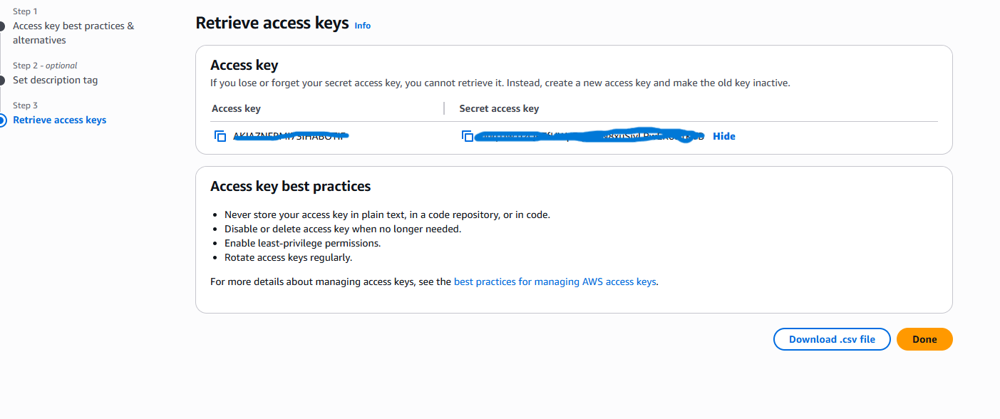
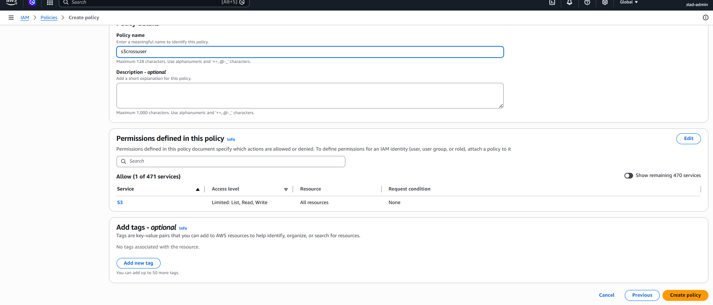
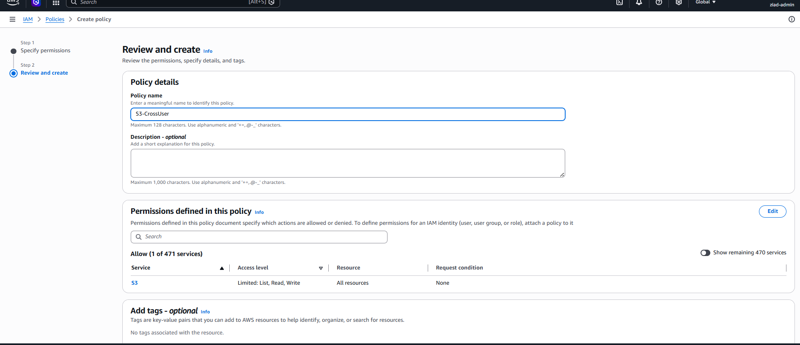
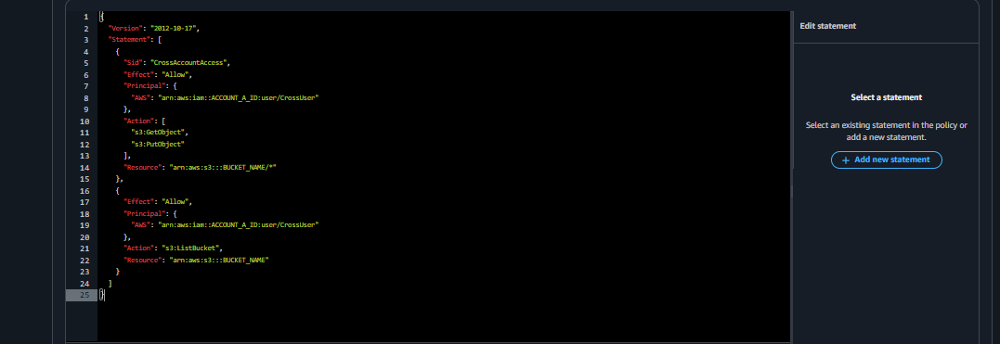
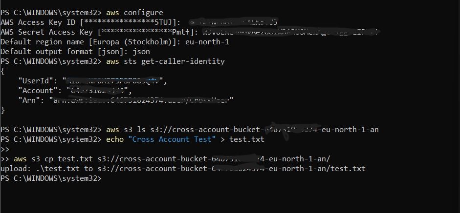
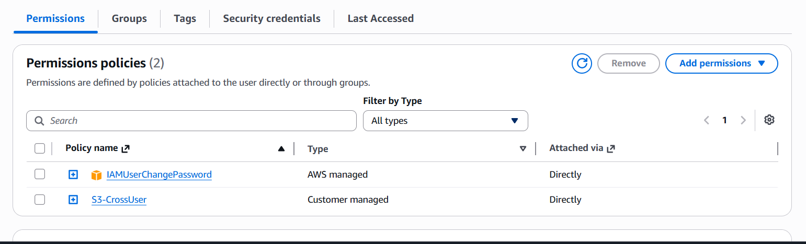

# Task 02 - Cross Account Access to Amazon S3

## Objective

The goal of this task is to allow an IAM User from one AWS Account to access an Amazon S3 Bucket located in another AWS Account using Cross-Account Access.

This demonstrates how AWS Identity and Access Management (IAM) and S3 Bucket Policies work together to securely share resources between different AWS accounts.

---

## Architecture

### Source Account

* IAM User: `CrossUser`
* IAM Policy: `S3-CrossUser`

⬇ Cross-Account Access

### Target Account

* Amazon S3 Bucket:
  `cross-account-bucket-646731024374-eu-north-1-an`

---

## Step 1: Create IAM User

Created an IAM user named:

```text
CrossUser
```

The user was configured with:

* AWS Management Console Access
* Programmatic Access

### Screenshot


---

## Step 2: Generate Access Keys

Generated Access Key ID and Secret Access Key for the IAM user.

These credentials are required to authenticate AWS CLI requests.

### Screenshot



---

## Step 3: Create IAM Policy

Created a custom IAM policy named:

```text
S3-CrossUser
```

The policy grants permissions to:

* List S3 buckets
* Upload objects
* Read objects

### Screenshot



---

## Step 4: Attach Policy to IAM User

Attached the custom IAM policy to the IAM user.

Policy:

```text
S3-CrossUser
```

User:

```text
CrossUser
```

### Screenshot



---

## Step 5: Configure S3 Bucket Policy

Configured a Bucket Policy in the target AWS account to allow cross-account access for the IAM user.

Granted permissions:

* s3:ListBucket
* s3:GetObject
* s3:PutObject

### Screenshot



---

## Step 6: Configure AWS CLI

Configured AWS CLI using:

```bash
aws configure
```

Provided:

```text
Access Key ID
Secret Access Key
Region: eu-north-1
Output Format: json
```

---

## Step 7: Verify Identity

Verified the active AWS identity:

```bash
aws sts get-caller-identity
```

The output confirmed authentication as the IAM user.

---

## Step 8: Upload File to Target S3 Bucket

Created a test file:

```bash
echo "Cross Account Test" > test.txt
```

Uploaded the file to the target bucket:

```bash
aws s3 cp test.txt s3://cross-account-bucket-646731024374-eu-north-1-an/
```

Successful output:

```text
upload: .\test.txt to s3://cross-account-bucket-646731024374-eu-north-1-an/test.txt
```

### Screenshot



---

## Additional Bucket Policy Configuration Screenshot



---

## Validation

Successfully completed:

* ✅ IAM User Creation
* ✅ Access Key Generation
* ✅ IAM Policy Creation
* ✅ Policy Attachment
* ✅ S3 Bucket Policy Configuration
* ✅ AWS CLI Configuration
* ✅ Identity Verification
* ✅ Cross-Account Access Validation
* ✅ File Upload to Amazon S3

---

## Technologies Used

* AWS IAM
* Amazon S3
* AWS CLI
* IAM Policies
* S3 Bucket Policies
* JSON
* Cross-Account Access

---

## Outcome

Successfully configured Cross-Account Access between two AWS accounts, allowing an IAM user from one account to securely access and upload objects to an Amazon S3 bucket located in another AWS account through IAM permissions and S3 Bucket Policies.
