# Task 04 - EC2 Instance Access to Amazon S3 Using IAM Role

## Overview

This task demonstrates how to securely grant an Amazon EC2 instance access to Amazon S3 using an IAM Role instead of AWS Access Keys.

Using IAM Roles is considered an AWS security best practice because temporary credentials are automatically provided to the EC2 instance through AWS Security Token Service (STS), eliminating the need to store access keys on the server.

The goal was to:

- Create an Amazon S3 Bucket.
- Launch and use an Amazon EC2 Instance.
- Create an IAM Role with S3 permissions.
- Attach the IAM Role to the EC2 instance.
- Verify role-based authentication.
- Access Amazon S3 from the EC2 instance.
- Upload files to Amazon S3 successfully.

---

# Architecture

```text
+----------------------+
|      EC2 Instance    |
|      (web-server)    |
+----------+-----------+
           |
           |
           v
+----------------------+
|    IAM Role          |
|    EC2-S3-Role       |
+----------+-----------+
           |
           |
           v
+----------------------+
|    Amazon S3 Bucket  |
| my-app-storage-      |
| 646731024374-        |
| us-east-1-an         |
+----------------------+
```

---

# AWS Services Used

- Amazon EC2
- Amazon S3
- AWS IAM
- IAM Roles
- AWS STS
- AWS CLI

---

# Step 1 - Create Amazon S3 Bucket

Created a new Amazon S3 bucket to store files uploaded from the EC2 instance.

Bucket Name:

```text
my-app-storage-646731024374-us-east-1-an
```

Configuration:

- General Purpose Bucket
- Block Public Access Enabled
- Bucket Versioning Disabled
- Default Encryption Enabled

### Screenshot

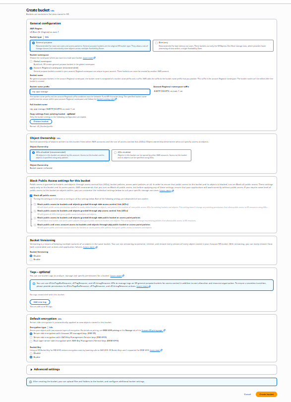

---

# Step 2 - Create Key Pair

Created an EC2 Key Pair to allow secure SSH access to the instance.

Configuration:

- Key Pair Type: RSA
- Private Key Format: PEM

The private key was downloaded and stored locally for SSH authentication.

### Screenshot

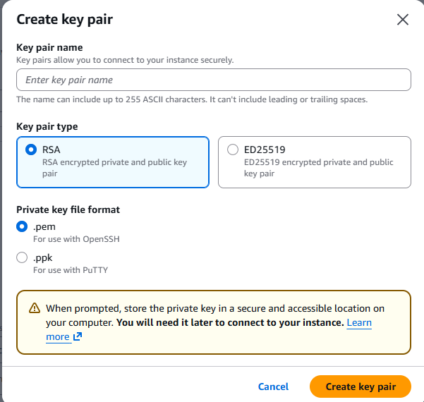

---

# Step 3 - Create IAM Role

Created a new IAM Role named:

```text
EC2-S3-Role
```

Trusted Entity:

```text
Amazon EC2
```

Trust Relationship:

```json
{
  "Version": "2012-10-17",
  "Statement": [
    {
      "Effect": "Allow",
      "Principal": {
        "Service": "ec2.amazonaws.com"
      },
      "Action": "sts:AssumeRole"
    }
  ]
}
```

This trust policy allows EC2 instances to assume the role and obtain temporary credentials.

### Screenshot

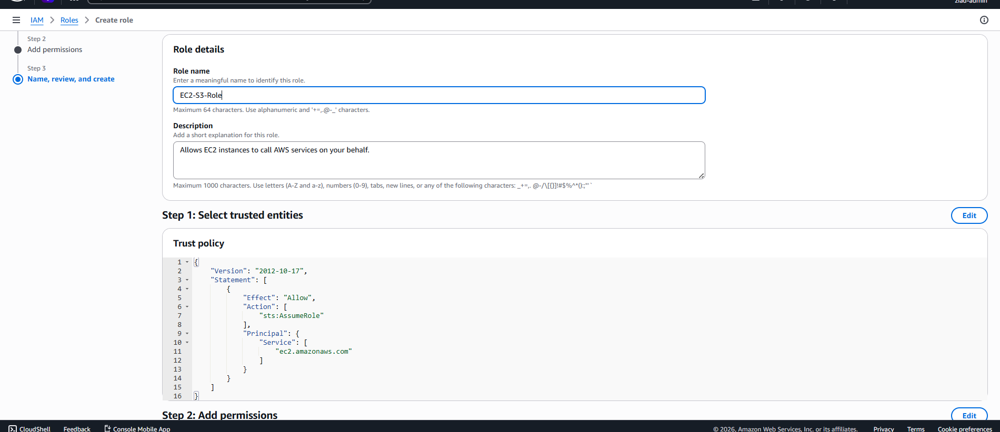

---

# Step 4 - Attach IAM Role to EC2 Instance

After creating the IAM Role, it was attached to the running EC2 instance.

Instance:

```text
web-server
```

Role Attached:

```text
EC2-S3-Role
```

This enables the instance to access AWS services according to the permissions granted to the role.

### Screenshot

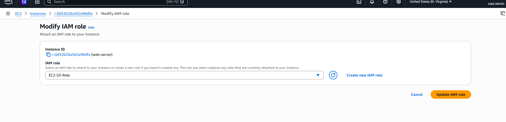

---

# Step 5 - Configure S3 Permissions

The IAM Role was granted permissions to interact with Amazon S3.

Permission Scope:

```text
Amazon S3 Full Access
```

Granted Capabilities:

- List Buckets
- Read Objects
- Upload Objects
- Delete Objects
- Manage Bucket Content

### Screenshot

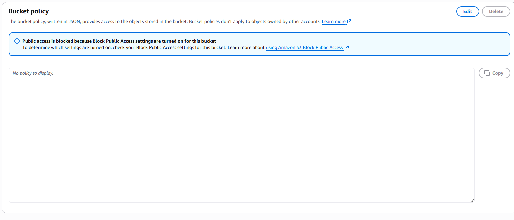

---

# Step 6 - Verify IAM Role Credentials

Connected to the EC2 instance and verified that temporary credentials were automatically assigned through the IAM Role.

Retrieve Attached Role:

```bash
curl http://169.254.169.254/latest/meta-data/iam/security-credentials/
```

Verify Identity:

```bash
aws sts get-caller-identity
```

Result:

```text
arn:aws:sts::646731024374:assumed-role/EC2-S3-Role
```

This confirms that the instance is authenticated using the IAM Role rather than Access Keys.

### Screenshot

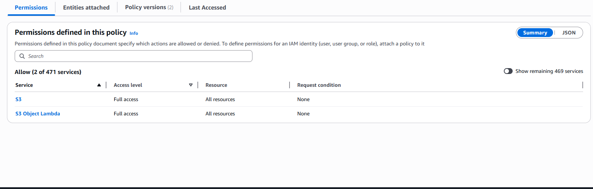

---

# Step 7 - Verify Amazon S3 Access

Verified that the EC2 instance could successfully access Amazon S3.

Commands Used:

```bash
aws s3 ls

aws s3api list-buckets
```

Result:

- Successfully listed available S3 buckets.
- Confirmed connectivity between EC2 and S3.

### Screenshot

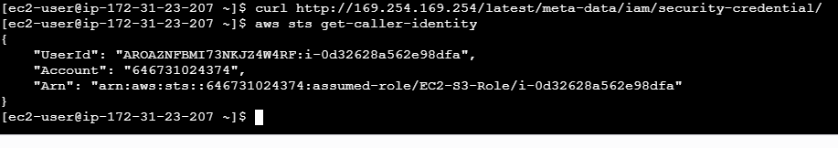

---

# Step 8 - Create Test File

Created a test file inside the EC2 instance.

Command:

```bash
echo "Hello from EC2" > test.txt
```

Verified File Content:

```bash
cat test.txt
```

Output:

```text
Hello from EC2
```

---

# Step 9 - Upload File to Amazon S3

Uploaded the file from the EC2 instance to the S3 bucket.

Command:

```bash
aws s3 cp test.txt s3://my-app-storage-646731024374-us-east-1-an/
```

Result:

```text
upload: ./test.txt to s3://my-app-storage-646731024374-us-east-1-an/test.txt
```

### Screenshot

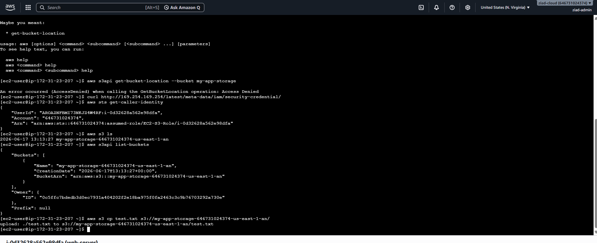

---

# Step 10 - Validate Upload

Verified that the uploaded file exists in the bucket.

Command:

```bash
aws s3 ls s3://my-app-storage-646731024374-us-east-1-an/
```

Result:

```text
test.txt
```

This confirms successful communication between EC2 and Amazon S3 using IAM Role authentication.

### Screenshot

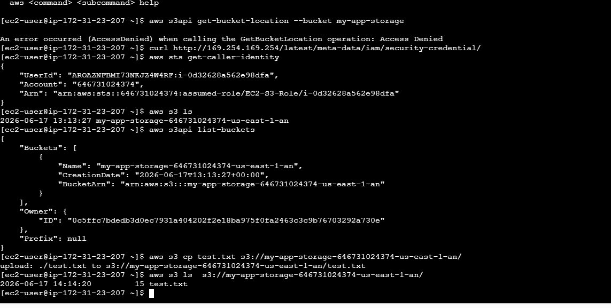

---

# Troubleshooting

During testing, an upload attempt initially failed due to insufficient permissions.

Error:

```text
AccessDenied
```

This issue was resolved after properly configuring IAM Role permissions and attaching the correct role to the EC2 instance.

### Screenshot

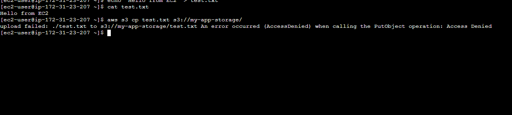

---

# Additional Validation

Reviewed S3 bucket configuration and access settings while troubleshooting permission issues.

### Screenshot

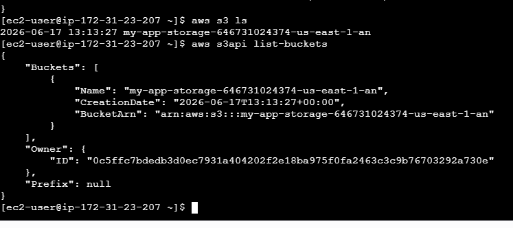

---

# Security Best Practices Applied

- No Access Keys stored on the EC2 instance.
- Used IAM Role instead of static credentials.
- Leveraged temporary credentials generated by AWS STS.
- Kept S3 Block Public Access enabled.
- Followed the principle of role-based authentication.

---

# Validation Checklist

| Validation Item | Status |
|----------------|---------|
| S3 Bucket Created | ✅ |
| EC2 Instance Running | ✅ |
| IAM Role Created | ✅ |
| IAM Role Attached | ✅ |
| Temporary Credentials Generated | ✅ |
| S3 Access Verified | ✅ |
| File Uploaded Successfully | ✅ |
| Upload Verified | ✅ |
| No Access Keys Used | ✅ |

---

# Outcome

Successfully configured an Amazon EC2 instance to access Amazon S3 using an IAM Role.

The EC2 instance automatically received temporary AWS credentials through the attached IAM Role, accessed Amazon S3, uploaded files successfully, and followed AWS security best practices by avoiding the use of long-term access keys.
